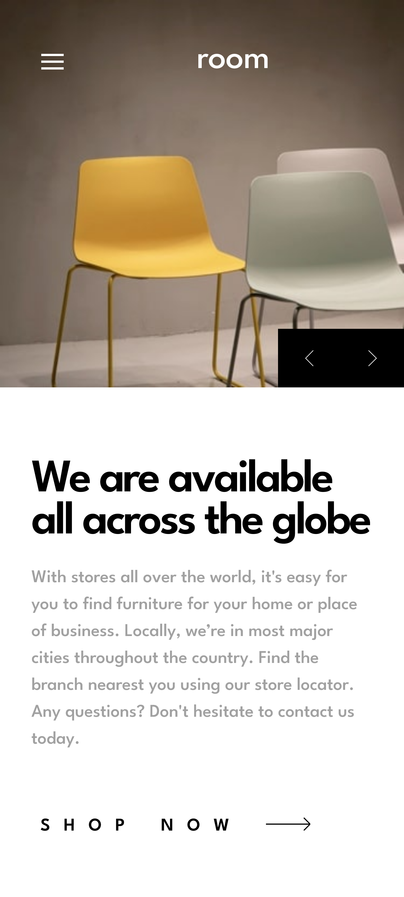

# Frontend Mentor - Room homepage solution

This is a solution to the [Room homepage challenge on Frontend Mentor](https://www.frontendmentor.io/challenges/room-homepage-BtdBY_ENq). Frontend Mentor challenges help you improve your coding skills by building realistic projects.

## Table of contents

- [Overview](#overview)
  - [The challenge](#the-challenge)
  - [Screenshot](#screenshot)
    - [Mobile Screenshot](#mobile-screenshot)
    - [Desktop Screenshot](#desktop-screenshot)
  - [Links](#links)
- [My process](#my-process)
  - [Built with](#built-with)
  - [Continued development](#continued-development)
- [Author](#author)

## Overview

### The challenge

Users should be able to:

- View the optimal layout for the site depending on their device's screen size
- See hover states for all interactive elements on the page
- Navigate the slider using either their mouse/trackpad or keyboard

### Screenshot

#### Mobile Screenshot

#### Desktop Screenshot

### Links

- Live Site URL: [Room homepage](https://code-stan.github.io/room-homepage)

## My process

### Built with

- Semantic HTML5 markup
- CSS custom properties
- Flexbox
- CSS Grid
- Mobile-first workflow
- SASS
- JavaScript

### Continued development

I was having difficulty adding animations to content that's been added by the JSON file when the slider button is clicked. I will like to research and use this in the future. If you there is any solution to this or any great resource please reach out 😉. (Thanks)

## Author

- Website - [CodeStan Portfolio](https://codestan.netlify.app/)
- Frontend Mentor - [@code-stan](https://www.frontendmentor.io/profile/code-stan)
- Twitter - [@Codestanley](https://www.twitter.com/codestanley)
